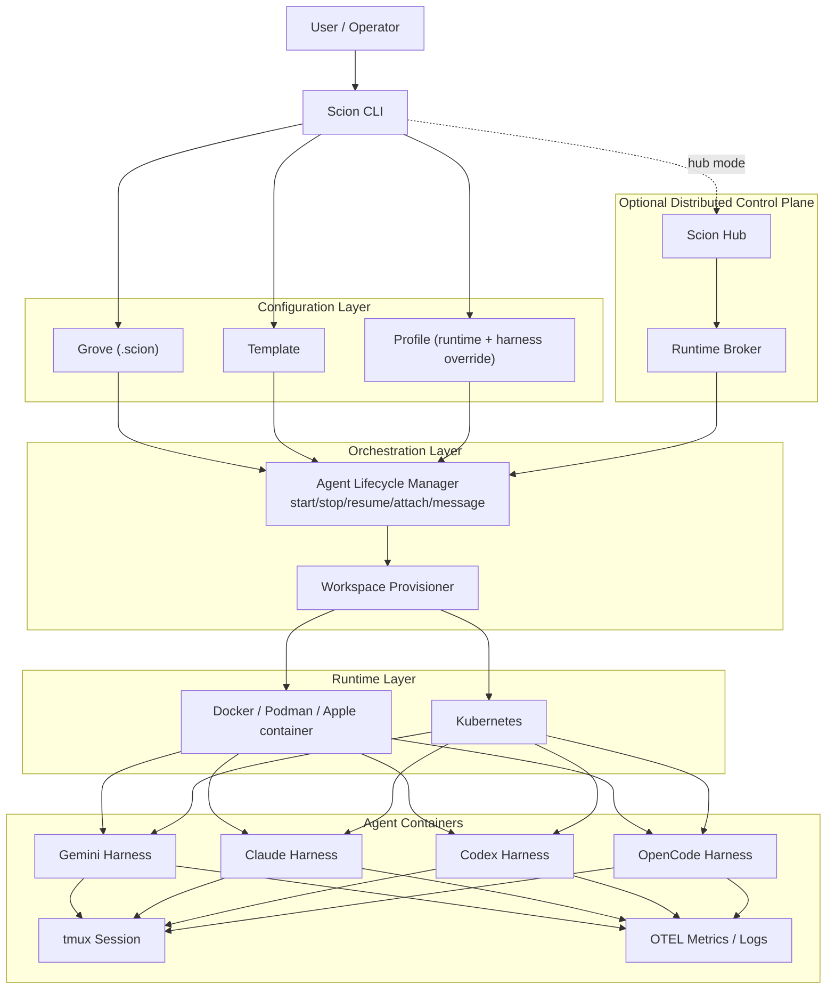
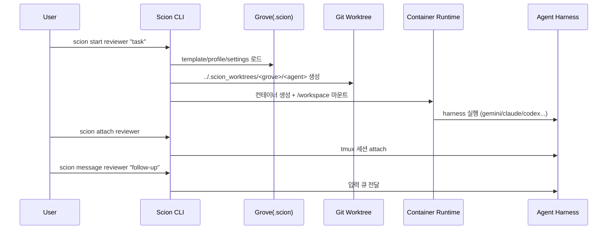
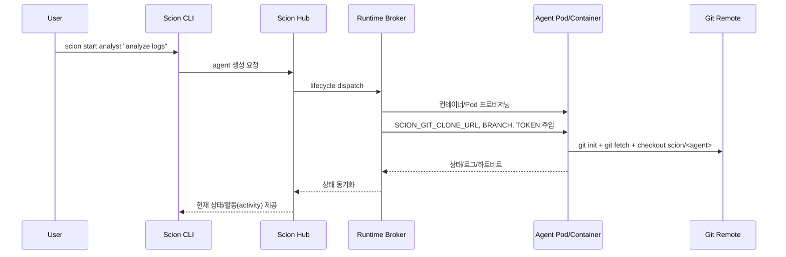
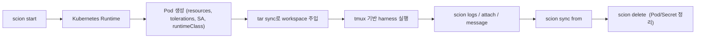

# Scion 아키텍처 다이어그램

## 1. 전체 시스템 계층 구조

```mermaid
flowchart TD
    U["User / Operator"] --> CLI["Scion CLI"]

    subgraph CFG["Configuration Layer"]
        G["Grove (.scion)"]
        T["Template"]
        P["Profile (runtime + harness override)"]
    end

    subgraph ORCH["Orchestration Layer"]
        O["Agent Lifecycle Manager<br/>start/stop/resume/attach/message"]
        W["Workspace Provisioner"]
    end

    subgraph RT["Runtime Layer"]
        R1["Docker / Podman / Apple container"]
        R2["Kubernetes"]
    end

    subgraph AG["Agent Containers"]
        A1["Gemini Harness"]
        A2["Claude Harness"]
        A3["Codex Harness"]
        A4["OpenCode Harness"]
        TM["tmux Session"]
        OT["OTEL Metrics / Logs"]
    end

    subgraph HUB["Optional Distributed Control Plane"]
        H["Scion Hub"]
        B["Runtime Broker"]
    end

    CLI --> G
    CLI --> T
    CLI --> P
    G --> O
    T --> O
    P --> O
    O --> W
    W --> R1
    W --> R2
    R1 --> A1
    R1 --> A2
    R1 --> A3
    R1 --> A4
    R2 --> A1
    R2 --> A2
    R2 --> A3
    R2 --> A4
    A1 --> TM
    A2 --> TM
    A3 --> TM
    A4 --> TM
    A1 --> OT
    A2 --> OT
    A3 --> OT
    A4 --> OT
    CLI -. hub mode .-> H
    H --> B
    B --> O
```

## 2. 로컬 모드 실행 흐름 (Git Worktree)

```mermaid
sequenceDiagram
    participant User as User
    participant CLI as Scion CLI
    participant Grove as Grove(.scion)
    participant Git as Git Worktree
    participant Runtime as Container Runtime
    participant Agent as Agent Harness

    User->>CLI: scion start reviewer "task"
    CLI->>Grove: template/profile/settings 로드
    CLI->>Git: ../.scion_worktrees/<grove>/<agent> 생성
    CLI->>Runtime: 컨테이너 생성 + /workspace 마운트
    Runtime->>Agent: harness 실행 (gemini/claude/codex...)
    User->>CLI: scion attach reviewer
    CLI->>Agent: tmux 세션 attach
    User->>CLI: scion message reviewer "follow-up"
    CLI->>Agent: 입력 큐 전달
```

## 3. Hub 모드 실행 흐름 (Broker + Remote Runtime)

```mermaid
sequenceDiagram
    participant User as User
    participant CLI as Scion CLI
    participant Hub as Scion Hub
    participant Broker as Runtime Broker
    participant Pod as Agent Pod/Container
    participant Repo as Git Remote

    User->>CLI: scion start analyst "analyze logs"
    CLI->>Hub: agent 생성 요청
    Hub->>Broker: lifecycle dispatch
    Broker->>Pod: 컨테이너/Pod 프로비저닝
    Broker->>Pod: SCION_GIT_CLONE_URL, BRANCH, TOKEN 주입
    Pod->>Repo: git init + git fetch + checkout scion/<agent>
    Pod-->>Broker: 상태/로그/하트비트
    Broker-->>Hub: 상태 동기화
    Hub-->>CLI: 현재 상태/활동(activity) 제공
```

## 4. Kubernetes 런타임 흐름

```mermaid
flowchart LR
    S["scion start"] --> K["Kubernetes Runtime"]
    K --> P["Pod 생성 (resources, tolerations, SA, runtimeClass)"]
    P --> X["tar sync로 workspace 주입"]
    X --> T["tmux 기반 harness 실행"]
    T --> L["scion logs / attach / message"]
    L --> Y["scion sync from <agent>"]
    Y --> D["scion delete <agent> (Pod/Secret 정리)"]
```
